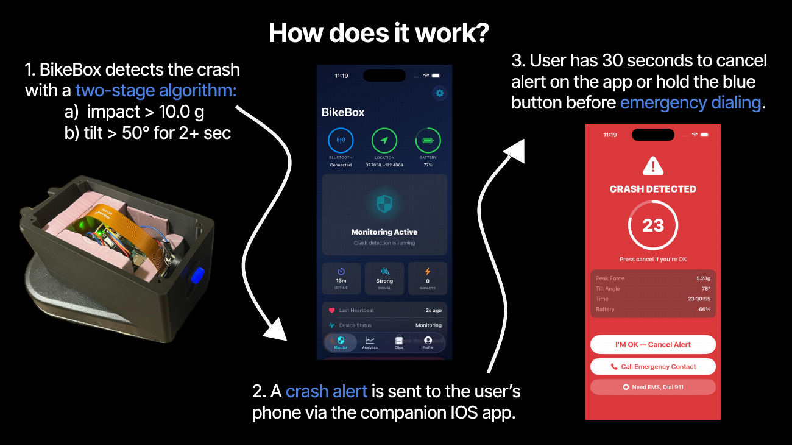
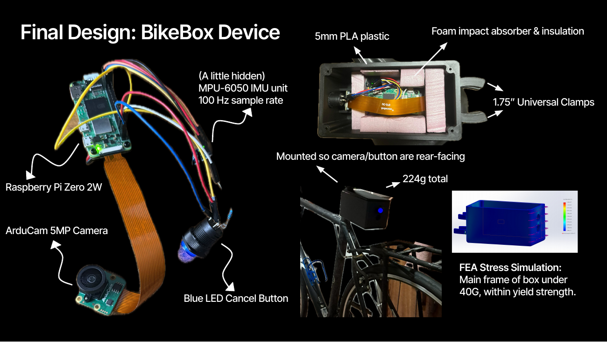
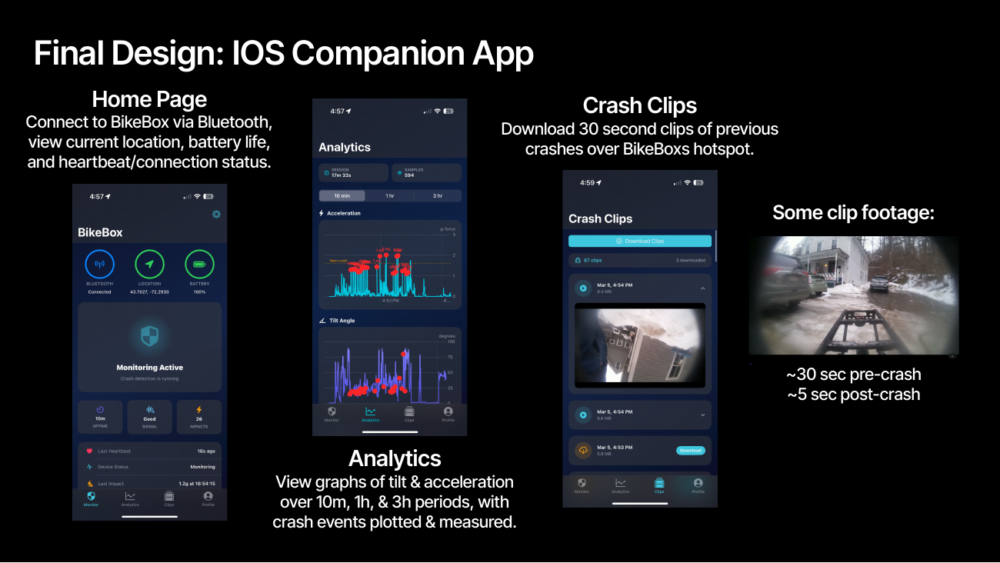
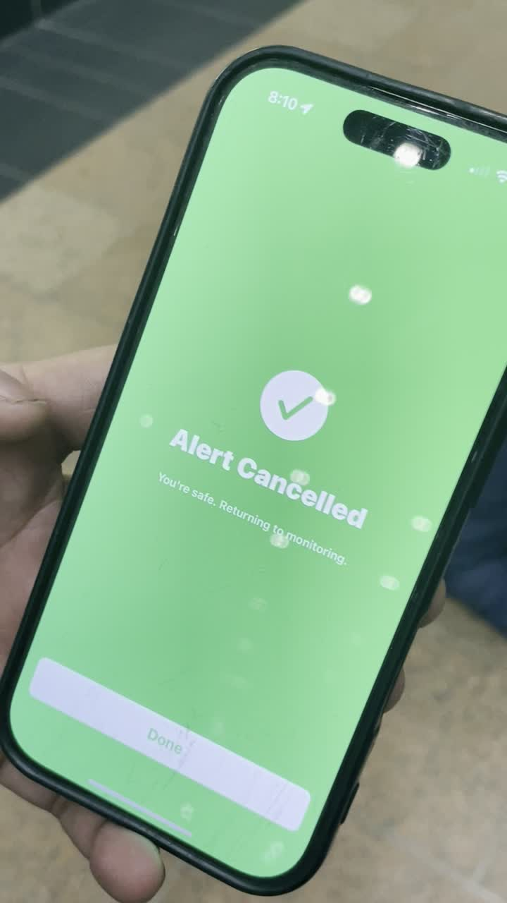
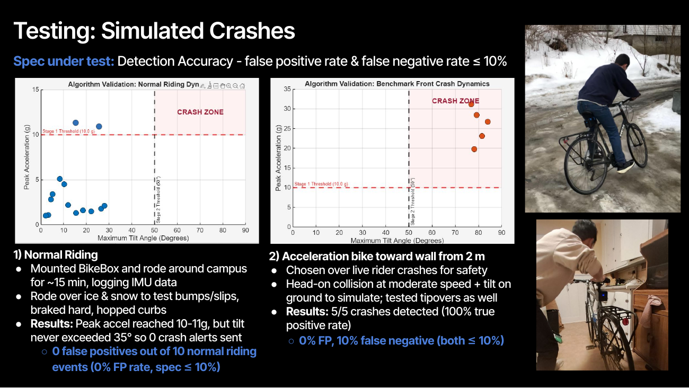
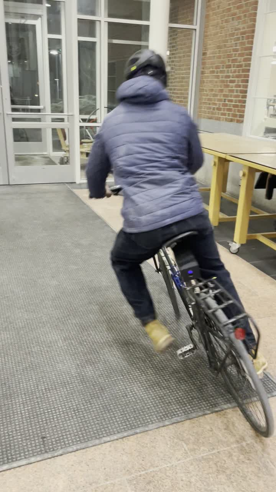

<h1 align="center">BikeBox</h1>

<p align="center">
  <b>An on-bike crash detection system: sensor fusion on a Raspberry Pi Zero 2,<br/>
  event-triggered video capture, and BLE-driven emergency dispatch through an iOS companion app.</b>
</p>

<p align="center">
  <sub>
    Dartmouth ENGS 21, Team 1
    &nbsp;·&nbsp;
    <a href="deliverables/Team%201%20ENGS%2021%20-%20Final%20Report.pdf">Final Report (PDF)</a>
    &nbsp;·&nbsp;
    <a href="deliverables/Team%201%20-%20BikeBox%20-%20Final%20Presentation.pdf">Presentation Deck (PDF)</a>
    &nbsp;·&nbsp;
  </sub>
</p>

---

## Problem

Cyclists on isolated roads have no automatic way to call for help if a crash knocks them out. There were 1,377 US bicycle fatalities in 2023, up 53% in a decade alone. As the [National Safety Council](https://injuryfacts.nsc.org/home-and-community/safety-topics/bicycle-deaths/) puts it: "Preventable deaths have risen while nonfatal injuries continue to decline by 29%, indicating a need for better emergency infrastructure to prevent fatalities."

The core problem? Solo cyclists on isolated roads have no automatic way to call for help if injured, turning survivable injuries into fatal outcomes due to delayed emergency responses.

Existing solutions fall short. Phone-based crash detection targets car crashes doesn't account for tilt or orientation. Our baseline testing with Apple Find My yielded zero percent accuracy, failing to trigger even at 27 g's, more than enough to hurt someone. Wearable options like Garmin and Fitbit rely on wrist motion, don't capture bike-specific dynamics, and require a $300-plus smartwatch.

That's why we built **BikeBox**: a bicycle-mounted 'black box' that *automatically* detects crashes and alerts emergency contacts, giving road cyclists and their families peace of mind on every ride.


---

## How It Works

<p align="center">
  https://github.com/user-attachments/assets/b5cbd0bf-aa93-4c80-8cc9-b738d834c615 
<p align="center">

<p align="center">
  
</p>

1. A two-stage algorithm detects the crash on-device from the IMU stream.
2. An alert reaches the paired iPhone over Bluetooth Low Energy in under 3 seconds.
3. The rider gets a 30-second window to cancel a false alarm (physical button or in-app).
4. If uncancelled, the phone dispatches a GPS-tagged emergency message and the device saves the video clip of the crash.

**Specs**

| Metric | Value |
| --- | --- |
| False positive rate | **0 / 20 events (0%)** on a 90 s ride with bumps, curb hops, hard braking |
| Detection on a 2 m wall collision | Confirmed in **< 3 s** end to end (impact to BLE alert on iPhone) |
| IMU sample rate | **100 Hz**, 6-axis (MPU-6050 over I2C at 400 kHz) |
| Detection loop latency | **~10 ms** per sample (10 ms poll + <1 ms compute) |

---

## Algorithm & Software

### Two-stage detection

The core algorithm in [`detector.py`](src/pi/detector.py) is free of any learned model, so every threshold is auditable and every branch is unit-tested. 

**Stage 1 is a dual-path trigger,**; a single accelerometer threshold misses low-speed side tipovers, where peak acceleration stays low but angular velocity crosses 200°/s cleanly. Our model:
- **Path A (hard impact):** acceleration magnitude `|a| > IMPACT_THRESHOLD`.
- **Path B (slow tipover):** angular velocity `|ω| > GYRO_THRESHOLD` while `|a| > GYRO_ACCEL_MIN`.

**Stage 2 is a tilt & orientation detector, which kills false opositives.** It waits 500 ms after impact, then requires tilt `θ = atan2(√(ax² + ay²), |az|)` to stay past 45° from vertical for a full 2 s. Bumps and braking spike the accelerometer but leave the bike upright, so Stage 2 rejects them.

```python
IMPACT_THRESHOLD    = 10.0     # g,   Stage 1 Path A
GYRO_THRESHOLD      = 200.0    # °/s, Stage 1 Path B
GYRO_ACCEL_MIN      = 2.5      # g,   Path B accel minimum
TILT_THRESHOLD      = 45.0     # deg, Stage 2 angle
SUSTAINED_TILT_TIME = 2.0      # s,   Stage 2 duration
```

### Validation

<p align="center">
  
  
</p>

### Event-Triggered Video

[`camera.py`](src/pi/camera.py) uses `libcamera` / `picamera2` with a `CircularOutput` sink over an `H264Encoder`. The hardware encoder writes continuously into a 20 s RAM ring; nothing hits the SD card until the detector calls `save_clip()`, which flushes the pre-event buffer, records a 5 s post-event tail, and remuxes to MP4. This is the same save-on-trigger pattern as a robot's onboard log.

```python
buffer_frames = VIDEO_FRAMERATE * CIRCULAR_BUFFER_SECONDS   # 30 fps × 20 s
self._output = CircularOutput(buffersize=buffer_frames)
self._picam.start_recording(self._encoder, self._output)
```

Clips are served over an on-demand SoftAP hotspot (`hotspot.py` + `clip_server.py`) that the phone raises via a BLE characteristic and that auto-tears-down after 5 minutes idle.

### Embedded Processes

| Characteristic | Access | Payload |
| --- | --- | --- |
| Crash Alert | Notify | state + peak_g + tilt + timestamp + battery + clip flag |
| Device Status | Read, Notify | state + battery + charging + uptime (30 s heartbeat) |
| Grace Period | Read, Write, Notify | state + seconds remaining (writable to cancel) |
| Hotspot Control | Read, Write, Notify | on-demand SoftAP control |

**Multi-function button on one GPIO input**
- Short press (< 1.0 s): safe shutdown
- Dead zone (1.0 to 3.0 s): ignored, prevents ambiguous inputs
- Long hold (≥ 3.0 s): cancel an active crash alert

**Grace Period Logic ([`alert.py`](src/pi/alert.py)):** on a confirmed crash, `on_crash()` reads battery, saves the clip on a background thread, emits `ALERT_CRASH_DETECTED` over BLE, then runs a 30 s countdown polling the button and BLE cancel flag at 10 Hz. A cancel emits `ALERT_CRASH_CANCELLED`; a timeout emits `ALERT_CRASH_CONFIRMED`, which triggers the iOS SMS escalation.

**BLE peripheral ([`ble_server.py`](src/pi/ble_server.py)):** a BlueZ D-Bus server running its own GLib loop in a background thread so the detector stays hot. Payloads are little-endian `struct`-packed to match the iOS decoder.

---

## Hardware

<p align="center">
  
</p>

The 224 g device packs a Raspberry Pi Zero 2 W, MPU-6050 IMU (100 Hz), ArduCam 5MP wide-angle camera, PiSugar 3 UPS, and an illuminated cancel button into a foam-lined 5 mm PLA enclosure, camera and button rear-facing. FEA confirmed the frame stays within PLA yield strength under a 40 g load. The Pi carries no GPS radio; the iPhone supplies the location fix at the moment of alert, which drops an antenna and keeps the Pi under 1.5 W.

---

## iOS App

<p align="center">
  
</p>

#### Screens

Pairing, Dashboard (live device state), Alert (countdown ring with "I'M OK"), Analytics (impact history + charts), Clip Feed (crash videos over the hotspot), and Profile (emergency contacts).

<p align="center">
  
  &nbsp;
  
</p>

#### Background BLE

`BluetoothManager.swift` uses `CBCentralManagerOptionRestoreIdentifierKey` plus the `bluetooth-central` background mode, so the BikeBox connection survives lock, backgrounding, and force-quit; iOS relaunches the app to deliver a crash notification.

#### Location on demand

`LocationService.swift` runs CoreLocation at reduced accuracy while idle and jumps to `kCLLocationAccuracyBest` the moment an alert arrives, so the SMS carries the best fix the phone can produce.


---

## Testing & Demos

### Onboard crash-cam clip

The 20 s pre-event rolling buffer plus a 5 s post-event tail, dumped to disk the instant the detector fires.

https://github.com/user-attachments/assets/91500636-1da7-42cf-9f01-67131091d9fb


### Field results

<p align="center">
  
</p>

0 false positives across 10 normal-riding events and 5/5 detections on staged wall collisions, both within the ≤10% spec. Every ride was logged with `--log` and analyzed offline.

<p align="center">
  
  &nbsp;
  
</p>


<sub>Built for Dartmouth ENGS 21, Winter 2026, by Team 1: Julian Vu, Mason Shriver, Aniket Dey, and Victory Igwe.</sub>
