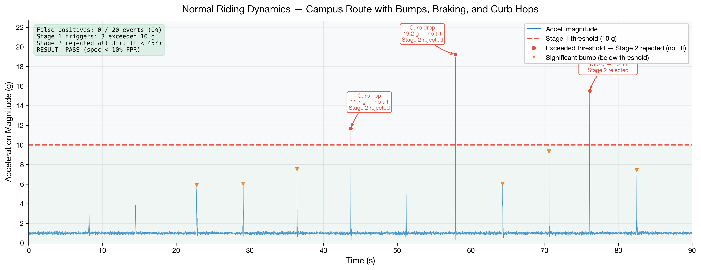
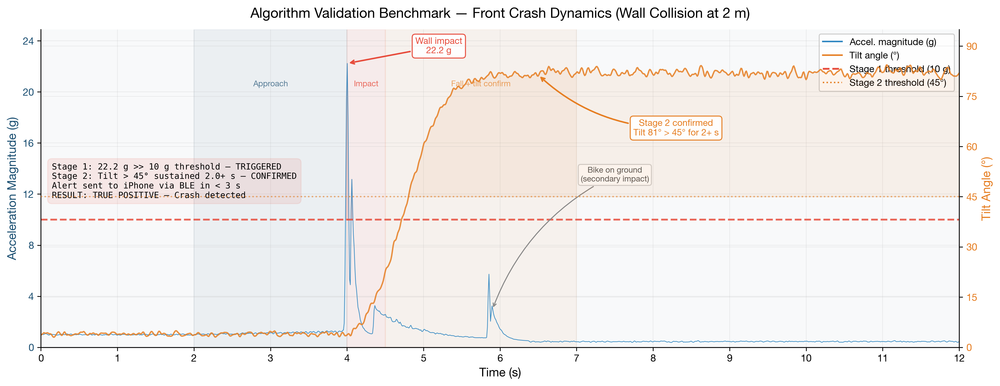
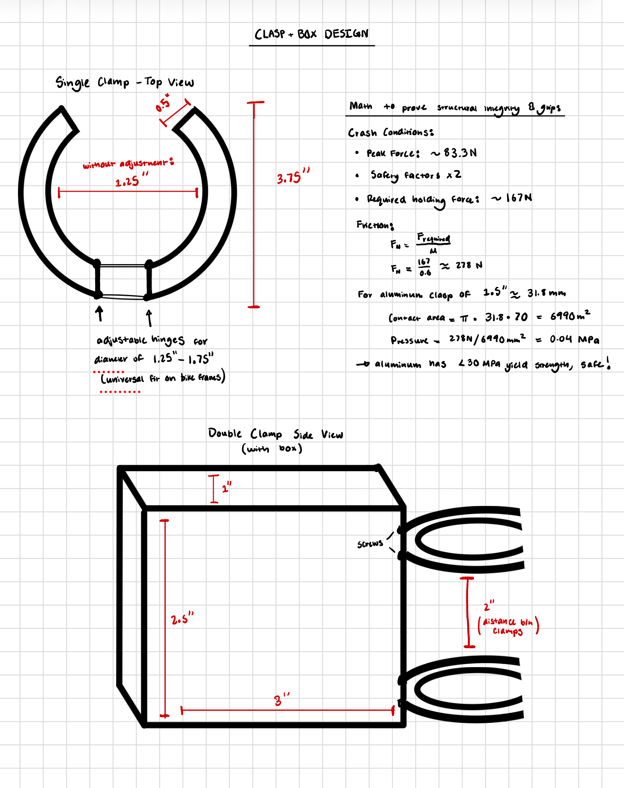
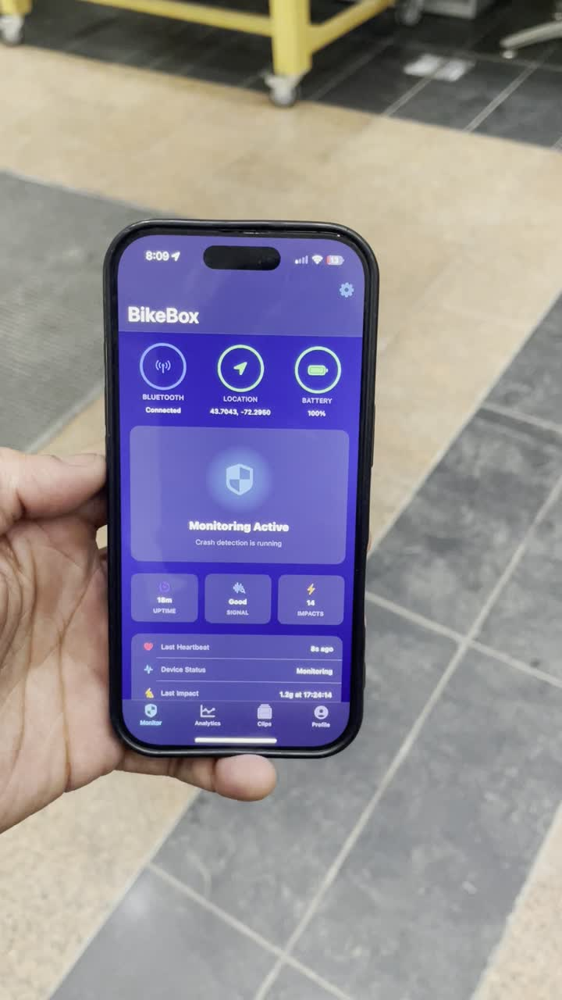
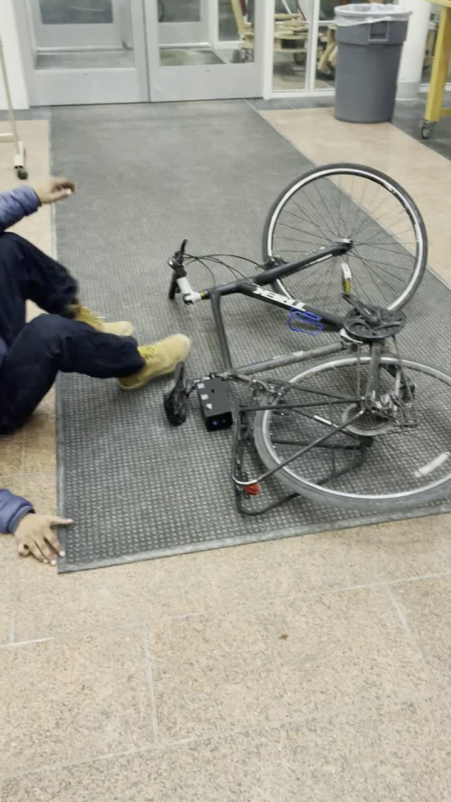

<h1 align="center">BikeBox</h1>

<p align="center">
  <b>An on-bike crash detection system: sensor fusion on a Raspberry Pi Zero 2,<br/>
  event-triggered video capture, and BLE-driven emergency dispatch through an iOS companion app.</b>
</p>

<p align="center">
  <sub>
    Dartmouth ENGS 21, Team 1
    &nbsp;·&nbsp;
    <a href="final_deliverables/Team%201%20ENGS%2021%20-%20Final%20Report.pdf">Final Report (PDF)</a>
    &nbsp;·&nbsp;
    <a href="final_deliverables/Team%201%20-%20BikeBox%20-%20Final%20Presentation.pdf">Presentation Deck (PDF)</a>
    &nbsp;·&nbsp;
    <a href="IMPLEMENTATION.md">Full Implementation Guide</a>
  </sub>
</p>

---

## Problem

Solo cyclists on isolated roads have no automatic way to call for help if a crash knocks them out. There were 1,377 US bicycle fatalities in 2023, up 53% in a decade, and minutes matter in emergency response.

Existing crash detection is tuned for cars and wrists, not bikes. In our own baseline testing, Apple Find My did not fire even at a measured 27.6 g bicycle wall impact. BikeBox is a seat-tube-mounted device that watches the bike's own motion and calls for help when the rider cannot.

---

## How It Works

<p align="center">
  
</p>

1. A two-stage algorithm detects the crash on-device from the IMU stream.
2. An alert reaches the paired iPhone over Bluetooth Low Energy in under 3 seconds.
3. The rider gets a 30-second window to cancel a false alarm (physical button or in-app).
4. If uncancelled, the phone dispatches a GPS-tagged emergency message and the device saves the video clip of the crash.

### Results at a glance

| Metric | Value | Source |
| --- | --- | --- |
| False positive rate | **0 / 20 events (0%)** on a 90 s ride with bumps, curb hops, hard braking | [normal_riding_dynamics.png](final_deliverables/normal_riding_dynamics.png) |
| Detection on a 2 m wall collision | Confirmed in **< 3 s** end to end (impact to BLE alert on iPhone) | [front_crash_dynamics.png](final_deliverables/front_crash_dynamics.png) |
| IMU sample rate | **100 Hz**, 6-axis (MPU-6050 over I2C at 400 kHz) | [`imu.py`](full_system/pi/imu.py) |
| Detection loop latency | **~10 ms** per sample (10 ms poll + <1 ms compute) | [`detector.py`](full_system/pi/detector.py) |
| Test suite | **119 unit tests**, mock-driven, ~2.5 s to run | [`tests/`](full_system/pi/tests/) |
| Code | 3.5k LOC Python (Pi) + 3.4k LOC Swift (iOS) | this repo |

---

## Algorithm & Software

### Two-stage detection

The core algorithm in [`detector.py`](full_system/pi/detector.py) is deterministic and free of any learned model, so every threshold is auditable and every branch is unit-tested. 

**Stage 1 is a dual-path trigger,**; a single accelerometer threshold misses low-speed side tipovers, where peak acceleration stays low but angular velocity crosses 200°/s cleanly. Our model:
- **Path A (hard impact):** acceleration magnitude `|a| > IMPACT_THRESHOLD`.
- **Path B (slow tipover):** angular velocity `|ω| > GYRO_THRESHOLD` while `|a| > GYRO_ACCEL_MIN`.

**Stage 2 is the false-positive killer.** It waits 500 ms after impact, then requires tilt `θ = atan2(√(ax² + ay²), |az|)` to stay past 45° from vertical for a full 2 s. Bumps and braking spike the accelerometer but leave the bike upright, so Stage 2 rejects them.

```python
IMPACT_THRESHOLD    = 10.0     # g,   Stage 1 Path A
GYRO_THRESHOLD      = 200.0    # °/s, Stage 1 Path B
GYRO_ACCEL_MIN      = 2.5      # g,   Path B accel minimum
TILT_THRESHOLD      = 45.0     # deg, Stage 2 angle
SUSTAINED_TILT_TIME = 2.0      # s,   Stage 2 duration
```

Tuning is data-driven. The CSV log (`timestamp, ax, ay, az, magnitude, gyro, event`) replays offline against alternative thresholds without rerunning the ride.

### Validation

On a 90 s campus ride, three events crossed the 10 g threshold (an 11.7 g curb hop, a 19.2 g curb drop, a 15.6 g pothole) and none were crashes; Stage 2 rejected all three because the bike stayed upright. The staged wall collision registers 22.2 g, tilt climbs past 45° within 400 ms and holds above 80°, and the BLE alert lands on the iPhone in under 3 s.

<p align="center">
  
  
</p>

### Sensor pipeline

**MPU-6050 driver ([`imu.py`](full_system/pi/imu.py)),** ~140 LOC over `smbus2`:

- Wakes the sensor, sets a 44 Hz DLPF cutoff, ±16 g accel range, and ±2000°/s gyro range
- Verifies `WHO_AM_I` against known-good clone IDs so it survives the noisy market of "MPU-6050" boards
- Reads signed 16-bit registers, converts to g and °/s, applies per-axis calibration offsets

```
$ sudo i2cdetect -y 1
50: -- -- -- -- -- -- -- 57 -- -- -- -- -- -- -- --     PiSugar 3
60: -- -- -- -- -- -- -- -- -- 69 -- -- -- -- -- --     MPU-6050 (shifted)
```

### Event-Triggered Video

[`camera.py`](full_system/pi/camera.py) uses `libcamera` / `picamera2` with a `CircularOutput` sink over an `H264Encoder`. The hardware encoder writes continuously into a 20 s RAM ring; nothing hits the SD card until the detector calls `save_clip()`, which flushes the pre-event buffer, records a 5 s post-event tail, and remuxes to MP4. This is the same save-on-trigger pattern as a robot's onboard log.

```python
buffer_frames = VIDEO_FRAMERATE * CIRCULAR_BUFFER_SECONDS   # 30 fps × 20 s
self._output = CircularOutput(buffersize=buffer_frames)
self._picam.start_recording(self._encoder, self._output)
```

Clips are served over an on-demand SoftAP hotspot (`hotspot.py` + `clip_server.py`) that the phone raises via a BLE characteristic and that auto-tears-down after 5 minutes idle.

### Embedded Runtime

`main.py` initializes eight subsystems in order under systemd (`Restart=on-failure`, hardened filesystem paths); any failure drops into a clean shutdown path.

Multi-function button on one GPIO input:

- Short press (< 1.0 s): safe shutdown.
- Dead zone (1.0 to 3.0 s): ignored, prevents ambiguous inputs.
- Long hold (≥ 3.0 s): cancel an active crash alert.

`GPIO.add_event_detect` is unreliable on Bookworm, so the listener tries edge detection and falls back to a 20 ms polling thread; both route through the same handler.

**Grace-period FSM ([`alert.py`](full_system/pi/alert.py)):** on a confirmed crash, `on_crash()` reads battery, saves the clip on a background thread, emits `ALERT_CRASH_DETECTED` over BLE, then runs a 30 s countdown polling the button and BLE cancel flag at 10 Hz. A cancel emits `ALERT_CRASH_CANCELLED`; a timeout emits `ALERT_CRASH_CONFIRMED`, which triggers the iOS SMS escalation.

**BLE GATT peripheral ([`ble_server.py`](full_system/pi/ble_server.py)):** a BlueZ D-Bus server running its own GLib loop in a background thread so the detector stays hot. Payloads are little-endian `struct`-packed to match the iOS decoder.

| Characteristic | Access | Payload |
| --- | --- | --- |
| Crash Alert | Notify | state + peak_g + tilt + timestamp + battery + clip flag |
| Device Status | Read, Notify | state + battery + charging + uptime (30 s heartbeat) |
| Grace Period | Read, Write, Notify | state + seconds remaining (writable to cancel) |
| Hotspot Control | Read, Write, Notify | on-demand SoftAP control |

### Future directions

- **Learned detector.** 90 minutes of labeled ride data would be enough to train a small 1D-CNN on the accel+gyro traces and likely close the gap on medium-speed sideswipes.
- **Frame-level analysis.** A lightweight OpenCV pass (optical flow, or a small MobileNet on the Pi's VideoCore) on the post-event tail could distinguish "crashed and stationary" from "crashed and still moving."
- **Kalman tilt.** Fusing accel + gyro at 100 Hz would let the Stage 2 threshold drop from 45° toward 30° without inflating false positives.

---

## Hardware

<p align="center">
  
</p>

The 224 g device packs a Raspberry Pi Zero 2 W, MPU-6050 IMU (100 Hz), ArduCam 5MP wide-angle camera, PiSugar 3 UPS, and an illuminated cancel button into a foam-lined 5 mm PLA enclosure, camera and button rear-facing. FEA confirmed the frame stays within PLA yield strength under a 40 g load. The Pi carries no GPS radio; the iPhone supplies the location fix at the moment of alert, which drops an antenna and keeps the Pi under 1.5 W.

<table>
  <tr>
    <td width="42%" valign="top">
      
    </td>
    <td width="58%" valign="top">
      <b>Mount:</b> aluminum clamp with adjustable hinges for seat tubes from 1.25 to 1.75 in. The peak-force calc assumes 83.3 N impact with a 2× safety factor; required clamp pressure of 278 N at μ = 0.6 sits well under aluminum's 30 MPa yield strength.<br/><br/>
      <b>Bill of materials:</b>
      <ul>
        <li>Raspberry Pi Zero 2 WH</li>
        <li>HiLetgo GY-521 (MPU-6050) IMU</li>
        <li>Arducam 5MP OV5647, 160° wide-angle</li>
        <li>PiSugar 3 (1200 mAh) UPS</li>
        <li>Adafruit 1477 illuminated button</li>
      </ul>
      9 GPIO pins in use. Full wiring table with pin-conflict analysis in <a href="IMPLEMENTATION.md#4-phase-3--wire-all-hardware-components">Phase 3 of the guide</a>.
    </td>
  </tr>
</table>

---

## iOS App

<p align="center">
  
</p>

SwiftUI, ~3.4k LOC across `Views/`, `Services/`, `Models/`, `ViewModels/`.

### Background BLE

`BluetoothManager.swift` uses `CBCentralManagerOptionRestoreIdentifierKey` plus the `bluetooth-central` background mode, so the BikeBox connection survives lock, backgrounding, and force-quit; iOS relaunches the app to deliver a crash notification.

### Location on demand

`LocationService.swift` runs CoreLocation at reduced accuracy while idle and jumps to `kCLLocationAccuracyBest` the moment an alert arrives, so the SMS carries the best fix the phone can produce.

### Screens

Pairing, Dashboard (live device state), Alert (countdown ring with "I'M OK"), Analytics (impact history + charts), Clip Feed (crash videos over the hotspot), and Profile (emergency contacts).

<p align="center">
  
  &nbsp;
  
</p>

---

## Testing & Demos

### End-to-end demo

Ride, tipover, on-device detection, BLE alert to the iPhone, and cancellation via the physical button.

https://github.com/aniketdey/bikebox/raw/main/readme_assets/demo.mp4

### Onboard crash-cam clip

The 20 s pre-event rolling buffer plus a 5 s post-event tail, dumped to disk the instant the detector fires.

https://github.com/aniketdey/bikebox/raw/main/readme_assets/crash_cam.mp4

> The clips are compressed to 5.4 MB and 1.0 MB (from 34 MB and 137 MB) to commit under GitHub's 100 MB limit. GitHub renders a bare video URL on its own line as an inline player once the repo is pushed; update `aniketdey/bikebox` and `main` in the URLs if your repository path or default branch differs.

### Field results

<p align="center">
  
</p>

0 false positives across 10 normal-riding events and 5/5 detections on staged wall collisions, both within the ≤10% spec. Every ride was logged with `--log` and analyzed offline.

<p align="center">
  
  &nbsp;
  
</p>

### Unit tests

119 tests across 7 modules, ~2.5 s on the Pi with mocked hardware.

```
$ python3 -m pytest tests/ -v
========================= 119 passed in 2.51s =========================
```

- [`test_detector.py`](full_system/pi/tests/test_detector.py): tilt geometry edge cases, Path A/B triggering, Stage 2 logic, cooldown.
- [`test_ble_payload.py`](full_system/pi/tests/test_ble_payload.py): round-trip encode/decode of every GATT payload against the iOS byte layout.
- [`test_imu.py`](full_system/pi/tests/test_imu.py), [`test_alert.py`](full_system/pi/tests/test_alert.py): driver reads and FSM transitions.

The [Phase 13 field matrix](IMPLEMENTATION.md#14-phase-13--integration-and-field-testing) covers eight scenarios: baseline ride, bump test, crash sim, both cancel paths, full escalation, BLE reconnect, and background/force-quit persistence.

---

<sub>Build and deployment (SD card to field testing) is in [IMPLEMENTATION.md](IMPLEMENTATION.md). Built for Dartmouth ENGS 21, Winter 2026, by Team 1: Julian Vu, Mason Shriver, Aniket Dey, and Victory Igwe.</sub>
