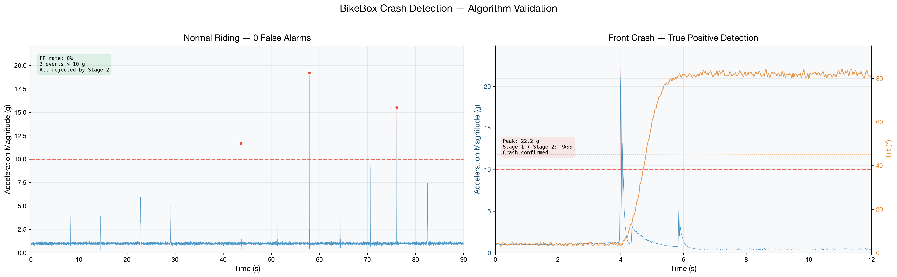
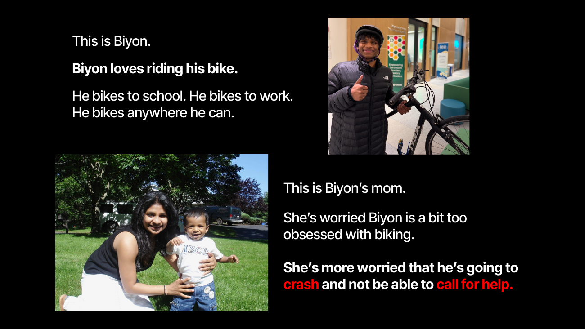
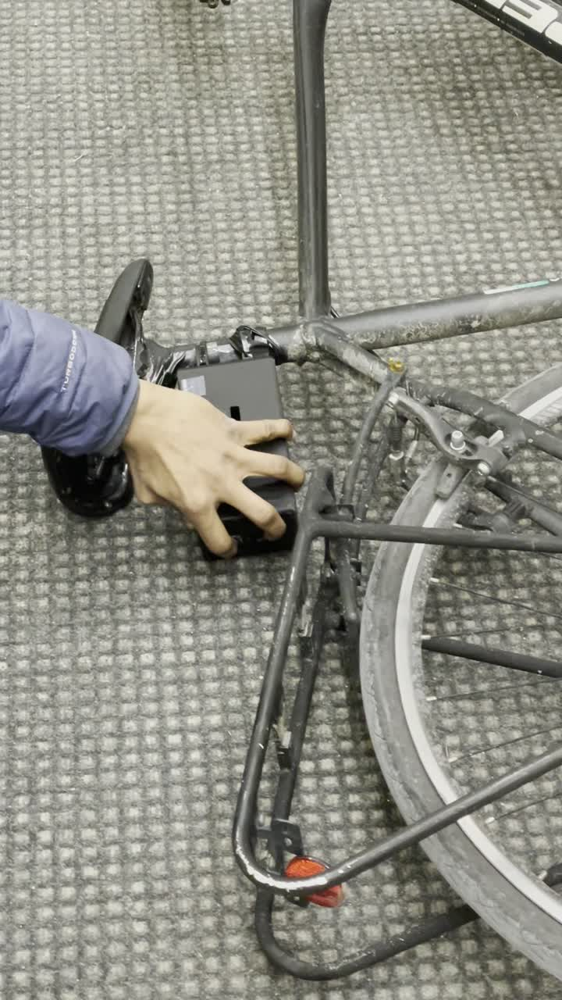
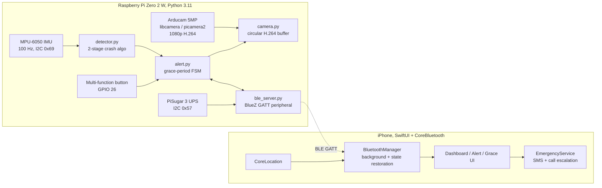
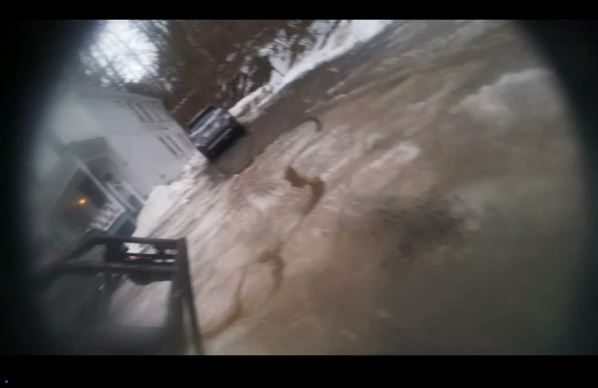

<h1 align="center">BikeBox</h1>

<p align="center">
  <b>An on-bike crash detection system: sensor fusion on a Raspberry Pi Zero 2,<br/>
  event-triggered video capture, and BLE-driven emergency dispatch through an iOS companion app.</b>
</p>

<p align="center">
  
</p>

<p align="center">
  <sub>
    Dartmouth ENGS 21, Team 1
    &nbsp;·&nbsp;
    <a href="final_deliverables/Team%201%20ENGS%2021%20-%20Final%20Report.pdf">Final Report (PDF)</a>
    &nbsp;·&nbsp;
    <a href="final_deliverables/Team%201%20-%20BikeBox%20-%20Final%20Presentation.pdf">Presentation Deck (PDF)</a>
    &nbsp;·&nbsp;
    <a href="IMPLEMENTATION.md">Full Implementation Guide</a>
  </sub>
</p>

---

## The problem

<p align="center">
  
</p>

Solo cyclists on isolated roads have no automatic way to call for help if a crash knocks them out. There were 1,377 US bicycle fatalities in 2023, up 53% in a decade. Phone and smartwatch crash detection is tuned for cars and wrists: in our own baseline testing, Apple Find My did not fire even at a 27.6 g bicycle wall impact.

BikeBox is a seat-tube-mounted device that watches the bike's own motion and calls for help when the rider cannot.

---

## How it works

<p align="center">
  
</p>

A two-stage algorithm detects the crash on-device, an alert reaches the paired iPhone over Bluetooth, and the rider gets 30 seconds to cancel a false alarm (physical button or in-app) before the phone dispatches a GPS-tagged emergency message.

### Headline results

| Metric | Value | Source |
| --- | --- | --- |
| False positive rate | **0 / 20 events (0%)** on a 90 s ride with bumps, curb hops, hard braking | [normal_riding_dynamics.png](final_deliverables/normal_riding_dynamics.png) |
| Detection on a 2 m wall collision | Confirmed in **< 3 s** end to end (impact to BLE alert on iPhone) | [front_crash_dynamics.png](final_deliverables/front_crash_dynamics.png) |
| IMU sample rate | **100 Hz**, 6-axis (MPU-6050 over I2C at 400 kHz) | [`imu.py`](full_system/pi/imu.py) |
| Detection loop latency | **~10 ms** per sample (10 ms poll + <1 ms compute) | [`detector.py`](full_system/pi/detector.py) |
| Test suite | **119 unit tests**, mock-driven, ~2.5 s to run | [`tests/`](full_system/pi/tests/) |
| Code | 3.5k LOC Python (Pi) + 3.4k LOC Swift (iOS) | this repo |

---

## Demo

**End-to-end field test:** ride, tipover, on-device detection, BLE alert to the iPhone, and cancellation via the physical button.

https://github.com/aniketdey/bikebox/raw/main/readme_assets/demo.mp4

**Onboard crash-cam clip (auto-saved):** the 20 s pre-event rolling buffer plus a 5 s post-event tail, dumped to disk by `camera.py` the instant the detector fires.

https://github.com/aniketdey/bikebox/raw/main/readme_assets/crash_cam.mp4

> The clips are compressed to 5.4 MB and 1.0 MB (from 34 MB and 137 MB) so they commit under GitHub's 100 MB limit. GitHub renders a bare video URL on its own line as an inline player once the repo is pushed; update `aniketdey/bikebox` and `main` in the URLs if your repository path or default branch differs.

<p align="center">
  
  &nbsp;
  
  &nbsp;
  
</p>

---

## System architecture



The Pi carries no GPS radio. It streams only crash-relevant data (peak g, tilt, peak angular velocity, timestamp, battery, clip availability) over BLE, and the iPhone attaches its own GPS fix at the moment of alert. This dropped an antenna, kept the Pi's power budget under 1.5 W, and put escalation where SMS and phone permissions live natively.

---

## The detection algorithm

The core algorithm in [`detector.py`](full_system/pi/detector.py) is deterministic and free of any learned model, so every threshold is auditable and every branch is unit-tested.

Stage 1 asks "did something violent just happen?" and runs on every sample. Stage 2 asks "is the bike actually down?" and only runs after Stage 1 fires.

```
IMU sample (100 Hz)  ┐
                     │
              ┌──────▼───────────────────────────────┐
              │  STAGE 1  ·  Dual-path trigger        │
              │                                       │
              │  Path A:  |a| > IMPACT_THRESHOLD      │  hard impacts
              │  Path B:  |ω| > GYRO_THRESHOLD  AND   │  slow tipovers
              │           |a| > GYRO_ACCEL_MIN        │  (rotation-dominant)
              └──────┬───────────────────────────────┘
                     │ triggered
                     │
              ┌──────▼───────────────────────────────┐
              │  STAGE 2  ·  Tilt confirmation        │
              │                                       │
              │  wait CONFIRM_WINDOW (0.5 s)          │
              │  θ = atan2(√(ax² + ay²), |az|)        │
              │  θ > TILT_THRESHOLD sustained for     │
              │  SUSTAINED_TILT_TIME (2 s)?           │
              └──────┬───────────────────────────────┘
                     │ confirmed
                     ▼
              on_crash(peak_g, tilt, timestamp)
```

**Dual-path Stage 1** is a small piece of sensor fusion. A single accelerometer threshold misses low-speed side tipovers, where peak acceleration stays low but angular velocity crosses 200°/s cleanly. Path A catches hard impacts; Path B catches rotation-dominant falls. Either can trigger, but both still require Stage 2 to confirm.

**Stage 2 is the false-positive killer.** On a 90 s campus ride, three events crossed the 10 g threshold (an 11.7 g curb hop, a 19.2 g curb drop, a 15.6 g pothole) and none were crashes. Stage 2 checks tilt 500 ms after impact and requires the bike to stay past 45° from vertical for 2 s, rejecting all three.

<p align="center">
  
  
</p>

The wall collision (right) registers 22.2 g, tilt climbs past 45° within 400 ms and holds above 80°, Stage 2 confirms, and the BLE alert lands on the iPhone in under 3 s.

### Thresholds

```python
IMPACT_THRESHOLD    = 10.0     # g,   Stage 1 Path A
GYRO_THRESHOLD      = 200.0    # °/s, Stage 1 Path B
GYRO_ACCEL_MIN      = 2.5      # g,   Path B accel minimum
TILT_THRESHOLD      = 45.0     # deg, Stage 2 angle
SUSTAINED_TILT_TIME = 2.0      # s,   Stage 2 duration
```

Tuning is data-driven. The CSV log (`timestamp, ax, ay, az, magnitude, gyro, event`) replays offline against alternative thresholds without rerunning the ride. The values in `config.py` are lower ("DEMO" mode) so the system can be hand-triggered for classroom demos; the numbers above are the validated production set.

---

## Sensor pipeline

**MPU-6050 driver ([`imu.py`](full_system/pi/imu.py)),** ~140 LOC over `smbus2`:

- Wakes the sensor, sets a 44 Hz DLPF cutoff, ±16 g accel range, and ±2000°/s gyro range.
- Verifies `WHO_AM_I` against known-good clone IDs so it survives the noisy market of "MPU-6050" boards.
- Reads signed 16-bit registers, converts to g and °/s, and applies per-axis calibration offsets.

**Calibration** averages 200 stationary samples at boot so a level device reads 1.0 g on Z; without it, clones show 0.1 to 0.3 g of horizontal bias that throws off both stages.

**Bus contention:** the PiSugar 3 UPS sits at I2C `0x68`, the MPU-6050 default. Tying the MPU's `AD0` pin to 3.3 V shifts it to `0x69`. A one-wire fix, but the kind of integration detail that costs a day if `i2cdetect` is not checked early.

```
$ sudo i2cdetect -y 1
     0  1  2  3  4  5  6  7  8  9  a  b  c  d  e  f
50: -- -- -- -- -- -- -- 57 -- -- -- -- -- -- -- --     ← PiSugar 3
60: -- -- -- -- -- -- -- -- -- 69 -- -- -- -- -- --     ← MPU-6050 (shifted)
```

---

## Event-triggered video capture

The camera pipeline in [`camera.py`](full_system/pi/camera.py) uses the `libcamera` / `picamera2` stack with a `CircularOutput` sink wrapping an `H264Encoder`:

```python
buffer_frames = VIDEO_FRAMERATE * CIRCULAR_BUFFER_SECONDS   # 30 fps × 20 s
self._output = CircularOutput(buffersize=buffer_frames)
self._picam.start_recording(self._encoder, self._output)
```

The hardware H.264 block encodes continuously into a RAM ring that overwrites every 20 s. Nothing hits the SD card until the detector calls `save_clip()`, which flushes the pre-event buffer, keeps recording for a 5 s post-event tail, and remuxes to MP4. This is the same save-on-trigger pattern as a robot's onboard log: cheap to run continuously, and the disk only sees writes that matter.

<p align="center">
  
  <br/><sub>A frame from a saved clip. The wide-angle fisheye distortion is visible; the horizon tilts because the camera moves with the bike.</sub>
</p>

Clips are served over an on-demand SoftAP hotspot (`hotspot.py` + `clip_server.py`) that the iPhone raises via a BLE control characteristic and that auto-tears-down after 5 minutes idle.

---

## Embedded software

`main.py` initializes eight subsystems in order under systemd (`Restart=on-failure`, hardened filesystem paths), and any failure drops into a clean shutdown path.

**The multi-function button ([`main.py`](full_system/pi/main.py) + [`alert.py`](full_system/pi/alert.py))** encodes three actions on one GPIO input:

```
< 1.0 s          →  Short press   →  Safe shutdown
1.0 to 3.0 s     →  Dead zone     →  Ignored (prevents ambiguous inputs)
≥ 3.0 s          →  Long hold     →  Cancel active crash alert
```

`GPIO.add_event_detect` is unreliable on Bookworm (the sysfs backend is being deprecated for `libgpiod`), so the listener tries edge detection and falls back to a 20 ms polling thread. Both route through the same handler, so the FSM in `alert.py` does not care which is running.

**Grace-period FSM ([`alert.py`](full_system/pi/alert.py)):** on a confirmed crash, `on_crash()` reads battery, kicks off the clip save on a background thread, emits `ALERT_CRASH_DETECTED` over BLE, then runs a 30 s countdown polling the button and BLE cancel flag at 10 Hz. A button long-hold or app cancel emits `ALERT_CRASH_CANCELLED`; a timeout emits `ALERT_CRASH_CONFIRMED`, which triggers the iOS SMS escalation. The two cancel sources are distinguishable in the payload.

**BLE GATT peripheral ([`ble_server.py`](full_system/pi/ble_server.py)):** a BlueZ D-Bus server running its own GLib loop in a background thread so the detector stays hot.

| Characteristic | UUID suffix `-0B1C-4E5D-8A9F-1234567890AB` | Access | Payload |
| --- | --- | --- | --- |
| Crash Alert | `CB000002-...` | Notify | state + peak_g + tilt + timestamp + battery + clip flag |
| Device Status | `CB000003-...` | Read, Notify | state + battery + charging + uptime (30 s heartbeat) |
| Grace Period | `CB000004-...` | Read, Write, Notify | state + seconds remaining (writable to cancel) |
| Hotspot Control | `CB000005-...` | Read, Write, Notify | on-demand SoftAP control |

All payloads are little-endian `struct`-packed to match the iOS decoder.

---

## Hardware

<p align="center">
  
</p>

The 224 g device packs a Raspberry Pi Zero 2 W, MPU-6050 IMU (100 Hz), ArduCam 5MP wide-angle camera, PiSugar 3 UPS, and an illuminated cancel button into a foam-lined 5 mm PLA enclosure, camera and button rear-facing. FEA confirmed the frame stays within PLA yield strength under a 40 g load.

<table>
  <tr>
    <td width="42%" valign="top">
      
    </td>
    <td width="58%" valign="top">
      <b>Mount:</b> aluminum clamp with adjustable hinges for seat tubes from 1.25 to 1.75 in. The peak-force calc assumes 83.3 N impact with a 2× safety factor; required clamp pressure of 278 N at μ = 0.6 sits well under aluminum's 30 MPa yield strength.<br/><br/>
      <b>Bill of materials:</b>
      <ul>
        <li>Raspberry Pi Zero 2 WH</li>
        <li>HiLetgo GY-521 (MPU-6050) IMU</li>
        <li>Arducam 5MP OV5647, 160° wide-angle</li>
        <li>PiSugar 3 (1200 mAh) UPS</li>
        <li>Adafruit 1477 illuminated button</li>
      </ul>
      9 GPIO pins in use. Full wiring table with pin-conflict analysis in <a href="IMPLEMENTATION.md#4-phase-3--wire-all-hardware-components">Phase 3 of the guide</a>.
    </td>
  </tr>
</table>

---

## iOS companion app

<p align="center">
  
</p>

SwiftUI, ~3.4k LOC across `Views/`, `Services/`, `Models/`, `ViewModels/`. Two pieces do the heavy lifting:

- **`BluetoothManager.swift`** uses `CBCentralManagerOptionRestoreIdentifierKey` plus the `bluetooth-central` background mode, so the BikeBox connection survives lock, backgrounding, and force-quit; iOS relaunches the app to deliver a crash notification.
- **`LocationService.swift`** runs CoreLocation at reduced accuracy while idle and jumps to `kCLLocationAccuracyBest` the moment an alert arrives, so the SMS carries the best fix the phone can produce.

Six screens: Pairing, Dashboard, Alert (countdown ring with "I'M OK"), Analytics (impact history + charts), Clip Feed (crash videos over the hotspot), and Profile (emergency contacts).

---

## Testing and validation

<p align="center">
  
</p>

**Field results:** 0 false positives across 10 normal-riding events and 5/5 detections on staged wall collisions, both within the ≤10% spec. Every ride was logged with `--log` and analyzed offline; the two dynamics charts above are the primary quantitative evidence.

**Unit tests:** 119 across 7 modules, ~2.5 s on the Pi with mocked hardware.

```
$ python3 -m pytest tests/ -v
========================= 119 passed in 2.51s =========================
```

- [`test_detector.py`](full_system/pi/tests/test_detector.py): 40+ tests covering tilt geometry edge cases, Path A/B triggering, Stage 2 logic, cooldown.
- [`test_ble_payload.py`](full_system/pi/tests/test_ble_payload.py): round-trip encode/decode of every GATT payload against the iOS byte layout.
- [`test_imu.py`](full_system/pi/tests/test_imu.py), [`test_alert.py`](full_system/pi/tests/test_alert.py): driver reads and FSM transitions.

The [Phase 13 field matrix](IMPLEMENTATION.md#14-phase-13--integration-and-field-testing) covers eight scenarios (baseline ride, bump test, crash sim, both cancel paths, full escalation, BLE reconnect, background/force-quit persistence).

<p align="center">
  
  &nbsp;
  
</p>

---

## Repository layout

```
bikebox/
├── README.md                          this file
├── IMPLEMENTATION.md                  1500-line deployment guide (bare Pi to armed system)
│
├── full_system/
│   ├── pi/                            Python 3.11 on Raspberry Pi OS Bookworm
│   │   ├── main.py                    startup, subsystem wiring, button FSM
│   │   ├── detector.py                two-stage crash detection algorithm
│   │   ├── imu.py                     MPU-6050 driver (100 Hz, register-level)
│   │   ├── camera.py                  picamera2 circular buffer + save-on-event
│   │   ├── alert.py                   grace-period FSM, cancel pipeline
│   │   ├── ble_server.py              BlueZ D-Bus GATT peripheral
│   │   ├── battery.py                 PiSugar 3 monitor
│   │   ├── hotspot.py                 on-demand SoftAP for clip download
│   │   ├── clip_server.py             HTTP server for saved MP4s
│   │   ├── config.py                  every threshold, UUID, and pin
│   │   └── tests/                     119 unit tests, mock-driven
│   │
│   └── ios/BikeBox/                   SwiftUI companion app
│       ├── Services/                  BLE, GPS, notifications, motion, emergency
│       ├── Views/                     Dashboard, Alert, Analytics, ClipFeed, Profile
│       ├── ViewModels/
│       └── Models/                    CrashAlert, DeviceStatus, GracePeriodState, ...
│
├── preliminaries/                     Early design work, MVP prototypes, sketches
├── final_deliverables/                Final report, deck, validation plots, videos
└── readme_assets/                     Compressed demo clips, slides, and frames
```

---

## Getting it running

Full deployment (SD card to field testing) is in [IMPLEMENTATION.md](IMPLEMENTATION.md). The short version:

```bash
# on the Raspberry Pi Zero 2 W (Bookworm 64-bit, headless)
sudo apt install -y python3-smbus2 python3-rpi.gpio python3-picamera2 \
                    python3-dbus python3-gi python3-gi-cairo bluez rpicam-apps

git clone <this-repo> ~/bikebox
cd ~/bikebox/full_system/pi

python3 -m pytest tests/ -v              # 119 tests, ~2.5 s
python3 main.py --test-imu               # live IMU readout
python3 main.py --test-ble               # BLE server standalone
python3 main.py                          # full system, foreground
python3 main.py --log ride.csv           # full system + CSV logging for tuning
```

Then enable the systemd unit for auto-start on boot, and build the iOS app in Xcode against your Apple ID (paired via BLE UUID `CB000001-0B1C-4E5D-8A9F-1234567890AB`).

---

## Extensions

- **Learned detector.** The two-stage rule is deliberately unlearned, which is right for an auditable class project. But 90 minutes of labeled ride data would be enough to train a small 1D-CNN on the accel+gyro traces and likely close the gap on the ambiguous middle regime (medium-speed sideswipes).
- **Frame-level analysis on saved clips.** A lightweight OpenCV pass (optical flow, or a small MobileNet on the Pi's VideoCore) on the post-event tail could distinguish "crashed and stationary" from "crashed and still moving" to sharpen escalation.
- **Kalman filter for tilt.** The tilt estimate is accelerometer-only atan2 and drifts under sustained acceleration. Fusing accel + gyro at 100 Hz would let the Stage 2 threshold drop from 45° toward 30° without inflating false positives.

---

## Credits

Built for Dartmouth ENGS 21, Winter 2026, by Team 1: **Julian Vu, Mason Shriver, Aniket Dey, and Victory Igwe**. All hardware, firmware, iOS code, and documentation in this repo is the team's own work.
